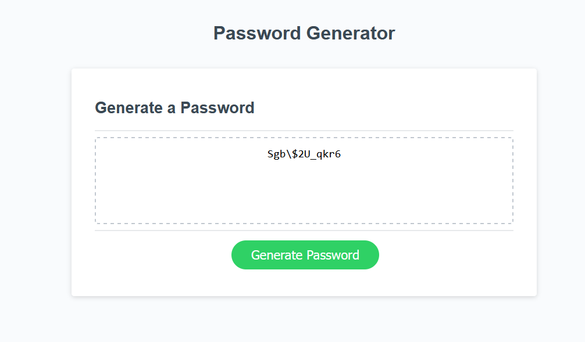

# password-generator

## deployed site 

## Overview

This app is used to generate a random password based on criteria selected by the user. This app runs in any browser, powered by javascripts. It adapts to multiple screen sizes.

## Usage 

You click Generate password button on the page 
* you will be present a series of prompts for password criteria
    * Length of password
      * At least 10 characters but no more than 64.
    * Character types
      * Lowercase
      * Uppercase
      * Numeric
      * Special characters ($@%&*, etc)
  * Each input validated and at least one character type should be selected
  * Once prompts are answered then the password will be generated and displayed on the page

  ## Technologies used

  HTML5, CSS and Javascripts 

  ## Conclusion 

  We hope this app will be a useful tool for anyone struggling to come up with passwords especailly in organisations that require users to change their passwords every few weeks for security reasons 